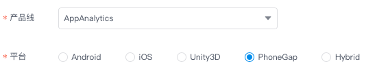

## TalkingData App Analytics Cordova/PhoneGap SDK
App Analytics Cordova 平台 SDK 由`封装层`和`Native SDK`两部分构成，目前GitHub上提供了封装层代码，需要从 [TalkingData官网](https://www.talkingdata.com/spa/sdk/#/config) 下载最新版的 Android 和 iOS 平台 Native SDK，组合使用。

### 集成说明
1. 下载本项目（封装层）到本地；  
2. 访问 [TalkingData官网](https://www.talkingdata.com/spa/sdk/#/config) 下载最新版的 Android 和 iOS 平台 App Analytics SDK（ Native SDK）
	- 方法1：选择 PhoneGap 平台进行功能定制；
	- 方法2：分别选择 Android 和 iOS 平台进行功能定制，请确保两个平台功能项一致；  
	
3. 将下载的最新版 `Native SDK` 复制到`封装层`中，构成完整的 Cordova SDK。  
	- Android 平台  
	将最新的 .jar 文件复制到 `src/android` 目录下
	- iOS 平台  
	将最新的 .a 文件复制到 `src/ios` 目录下
4. 按 `Native SDK` 功能选项对`封装层`代码进行必要的删减，详见“注意事项”第2条；
5. 将 Cordova SDK 集成您需要统计的工程中，并按 [集成文档](http://doc.talkingdata.com/posts/35) 进行必要配置和功能调用。

### 注意事项
1. 分别选择 Android 和 iOS 平台进行功能定制时，请确保两个平台功能项一致。
2. 如果申请 Native SDK 时只选择了部分功能，则需要在本项目中删除未选择功能对应的封装层代码。  
	a) 未选择`自定义事件`功能则删除以下5部分  
	删除 `www/TalkingData.js` 文件中如下代码：
	
	```
		onEvent:function(eventId) {
			cordova.exec(null, null, "TalkingData", "onEvent", [eventId]);
		},
		
		onEventWithLabel:function(eventId, eventLabel) {
			cordova.exec(null, null, "TalkingData", "onEventWithLabel", [eventId, eventLabel]);
		},
		
		onEventWithParameters:function(eventId, eventLabel, eventData) {
			var eventDataJson = JSON.stringify(eventData);
			cordova.exec(null, null, "TalkingData", "onEventWithParameters", [eventId, eventLabel, eventDataJson]);
		},
	```
	删除 `src/android/TalkingDataPlugin.java` 文件中如下代码：
	
	```
		} else if (action.equals("onEvent")) {
			...
			return true;
		} else if (action.equals("onEventWithLabel")) {
			...
			return true;
		} else if (action.equals("onEventWithParameters")) {
			...
			return true;
	```
	```
		private Map<String, Object> toMap(String jsonStr)
		{
			...
		}
	```
	删除 `src/ios/TalkingDataPlugin.h` 文件中如下代码：
	
	```
	- (void)onEvent:(CDVInvokedUrlCommand*)command;
	- (void)onEventWithLabel:(CDVInvokedUrlCommand*)command;
	- (void)onEventWithParameters:(CDVInvokedUrlCommand*)command;
	```
	删除 `src/ios/TalkingDataPlugin.m` 文件中如下代码：
	
	```
	- (void)onEvent:(CDVInvokedUrlCommand*)command {
		...
	}
	
	- (void)onEventWithLabel:(CDVInvokedUrlCommand*)command {
		...
	}
	
	- (void)onEventWithParameters:(CDVInvokedUrlCommand*)command {
		...
	}
	```
	删除 `src/ios/TalkingData.h` 文件中如下代码：
	
	```
	+ (void)trackEvent:(NSString *)eventId;
	+ (void)trackEvent:(NSString *)eventId label:(NSString *)eventLabel;
	+ (void)trackEvent:(NSString *)eventId 
	             label:(NSString *)eventLabel 
	        parameters:(NSDictionary *)parameters;
	+ (void)setGlobalKV:(NSString *)key value:(id)value;
	+ (void)removeGlobalKV:(NSString *)key;
	```
	b) 未选择`标准化事件分析`功能则删除以下8部分  
	删除 `plugin.xml` 文件中如下代码：
	
	```
		<js-module src="www/TalkingDataOrder.js" name="TalkingDataOrder">
			<clobbers target="TalkingDataOrder" />
    	</js-module>
		<js-module src="www/TalkingDataShoppingCart.js" name="TalkingDataShoppingCart">
			<clobbers target="TalkingDataShoppingCart" />
		</js-module>
	```
	删除 `www/TalkingDataOrder.js` 文件  
	删除 `www/TalkingDataShoppingCart.js` 文件  
	删除 `www/TalkingData.js` 文件中如下代码：
	
	```
		onPlaceOrder:function(accountId, order) {
			var orderJson = JSON.stringify(order);
			cordova.exec(null, null, "TalkingData", "onPlaceOrder", [accountId, orderJson]);
		},
		onOrderPaySucc:function(accountId, payType, order) {
			var orderJson = JSON.stringify(order);
			cordova.exec(null, null, "TalkingData", "onOrderPaySucc", [accountId, payType, orderJson]);
		},
		onViewItem:function(itemId, category, name, unitPrice) {
			cordova.exec(null, null, "TalkingData", "onViewItem", [itemId, category, name, unitPrice]);
		},
		onAddItemToShoppingCart:function(itemId, category, name, unitPrice, amount) {
			cordova.exec(null, null, "TalkingData", "onAddItemToShoppingCart", [itemId, category, name, unitPrice, amount]);
		},
		onViewShoppingCart:function(shoppingCart) {
			var shoppingCartJson = JSON.stringify(shoppingCart);
			cordova.exec(null, null, "TalkingData", "onViewShoppingCart", [shoppingCartJson]);
		},
	```
	删除 `src/android/TalkingDataPlugin.java` 文件中如下代码：
	
	```
	import com.tendcloud.tenddata.Order;
	import com.tendcloud.tenddata.ShoppingCart;
	```
	```
			} else if (action.equals("onPlaceOrder")) {
				...
				return true;
			} else if (action.equals("onOrderPaySucc")) {
				...
				return true;
			} else if (action.equals("onViewItem")) {
				...
				return true;
			} else if (action.equals("onAddItemToShoppingCart")) {
				...
				return true;
			} else if (action.equals("onViewShoppingCart")) {
				...
				return true;
	```
	```
		private Order stringToOrder(String orderStr) {
			...
		}
		
		private ShoppingCart stringToShoppingCart(String shoppingCartStr) {
			...
		}
	```
	删除 `src/ios/TalkingDataPlugin.h` 文件中如下代码：
	
	```
	- (void)onPlaceOrder:(CDVInvokedUrlCommand*)command;
	- (void)onOrderPaySucc:(CDVInvokedUrlCommand*)command;
	- (void)onViewItem:(CDVInvokedUrlCommand*)command;
	- (void)onAddItemToShoppingCart:(CDVInvokedUrlCommand*)command;
	- (void)onViewShoppingCart:(CDVInvokedUrlCommand*)command;
	```
	删除 `src/ios/TalkingDataPlugin.m` 文件中如下代码：
	
	```
	- (void)onPlaceOrder:(CDVInvokedUrlCommand*)command {
		...
	}
	
	- (void)onOrderPaySucc:(CDVInvokedUrlCommand*)command {
		...
	}
	
	- (void)onViewItem:(CDVInvokedUrlCommand*)command {
		...
	}
	
	- (void)onAddItemToShoppingCart:(CDVInvokedUrlCommand*)command {
		...
	}
	
	- (void)onViewShoppingCart:(CDVInvokedUrlCommand*)command {
		...
	}
	```
	```
	- (TalkingDataOrder *)stringToOrder:(NSString *)orderStr {
		...
	}
	
	- (TalkingDataShoppingCart *)stringToShoppingCart:(NSString *)shoppingCartStr {
		...
	}
	```
	删除 `src/ios/TalkingData.h` 文件中如下代码：
	
	```
	@interface TalkingDataOrder : NSObject
	+ (TalkingDataOrder *)createOrder:(NSString *)orderId total:(int)total currencyType:(NSString *)currencyType;
	- (TalkingDataOrder *)addItem:(NSString *)itemId category:(NSString *)category name:(NSString *)name unitPrice:(int)unitPrice amount:(int)amount;
	@end
	
	@interface TalkingDataShoppingCart : NSObject
	+ (TalkingDataShoppingCart *)createShoppingCart;
	- (TalkingDataShoppingCart *)addItem:(NSString *)itemId category:(NSString *)category name:(NSString *)name unitPrice:(int)unitPrice amount:(int)amount;
	@end
	```
	```
	+ (void)onPlaceOrder:(NSString *)account order:(TalkingDataOrder *)order;
	+ (void)onOrderPaySucc:(NSString *)account payType:(NSString *)payType order:(TalkingDataOrder *)order;
	+ (void)onViewItem:(NSString *)itemId category:(NSString *)category name:(NSString *)name unitPrice:(int)unitPrice;
	+ (void)onAddItemToShoppingCart:(NSString *)itemId category:(NSString *)category name:(NSString *)name unitPrice:(int)unitPrice amount:(int)amount;
	+ (void)onViewShoppingCart:(TalkingDataShoppingCart *)shoppingCart;
	```
	c) 未选择`页面统计`功能则删除以下5部分  
	删除 `www/TalkingData.js` 文件中如下代码：
	
	```
		onPage:function(pageName) {
			cordova.exec(null, null, "TalkingData", "onPage", [pageName]);
		},
		onPageBegin:function(pageName) {
			cordova.exec(null, null, "TalkingData", "onPageBegin", [pageName]);
		},
		onPageEnd:function(pageName) {
			cordova.exec(null, null, "TalkingData", "onPageEnd", [pageName]);
		},
	```
	删除 `src/android/TalkingDataPlugin.java` 文件中如下代码：
	
	```
			} else if (action.equals("onPage")) {
				...
				return true;
			} else if (action.equals("onPageBegin")) {
				...
				return true;
			} else if (action.equals("onPageEnd")) {
				...
				return true;
	```
	删除 `src/ios/TalkingDataPlugin.h` 文件中如下代码：
	
	```
	- (void)onPage:(CDVInvokedUrlCommand*)command;
	- (void)onPageBegin:(CDVInvokedUrlCommand*)command;
	- (void)onPageEnd:(CDVInvokedUrlCommand*)command;
	```
	删除 `src/ios/TalkingDataPlugin.m` 文件中如下代码：
	
	```
	#if __has_feature(objc_arc)
	@property (nonatomic, strong) NSString *currPageName;
	#else
	@property (nonatomic, retain) NSString *currPageName;
	#endif
	```
	```
	#if __has_feature(objc_arc)
	#else
	- (void)dealloc {
		[super dealloc];
		[self.currPageName release];
	}
	#endif
	```
	```
	- (void)onPage:(CDVInvokedUrlCommand*)command {
		...
	}
	
	- (void)onPageBegin:(CDVInvokedUrlCommand*)command {
		...
	}
	
	- (void)onPageEnd:(CDVInvokedUrlCommand*)command {
		...
	}
	```
	删除 `src/ios/TalkingData.h` 文件中如下代码：
	
	```
	+ (void)trackPageBegin:(NSString *)pageName;
	+ (void)trackPageEnd:(NSString *)pageName;
	```
	d) 未选择`灵动分析`功能无需删除封装层代码  
	e) 未选择`用户质量评估`功能则删除以下5部分  
	删除 `js/TalkingData.js` 文件中如下代码：
	
	```
		setAntiCheatingEnabled:function(enabled) {
			cordova.exec(null, null, "TalkingData", "setAntiCheatingEnabled", [enabled]);
		},
	```
	删除 `src/android/TalkingDataPlugin.java` 文件中如下代码：
	
	```
			} else if (action.equals("setAntiCheatingEnabled")) {
				...
				return true;
	```
	删除 `src/ios/TakjubgDataPlugin.h` 文件中如下代码：
	
	```
	- (void)setAntiCheatingEnabled:(CDVInvokedUrlCommand*)command;
	```
	删除 `src/ios/TalkingDataPlugin.m` 文件中如下代码：
	
	```
	- (void)setAntiCheatingEnabled:(CDVInvokedUrlCommand*)command {
		...
	}
	```
	删除 `src/ios/TalkingData.h` 文件中如下代码：
	
	```
	+ (void)setAntiCheatingEnabled:(BOOL)enabled;
	```
	f) 未选择`推送营销`功能则删除以下1部分  
	删除 `src/ios/TalkingData.h` 文件中如下代码：

	```
	+ (void)setDeviceToken:(NSData *)deviceToken;
	+ (BOOL)handlePushMessage:(NSDictionary *)message;
	```
	g) 未选择`易认证`功能则删除以下5部分  
	删除 `www/TalkingDataSMS.js` 文件  
	删除 `src/android/TalkingDataSMSPlugin.java` 文件  
	删除 `src/ios/TalkingDataSMSPlugin.h` 文件  
	删除 `src/ios/TalkingDataSMSPlugin.m` 文件  
	删除 `src/ios/TalkingDataSMS.h` 文件  
